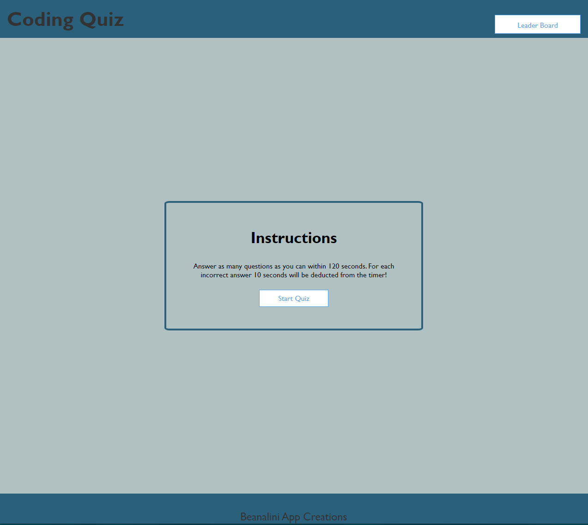
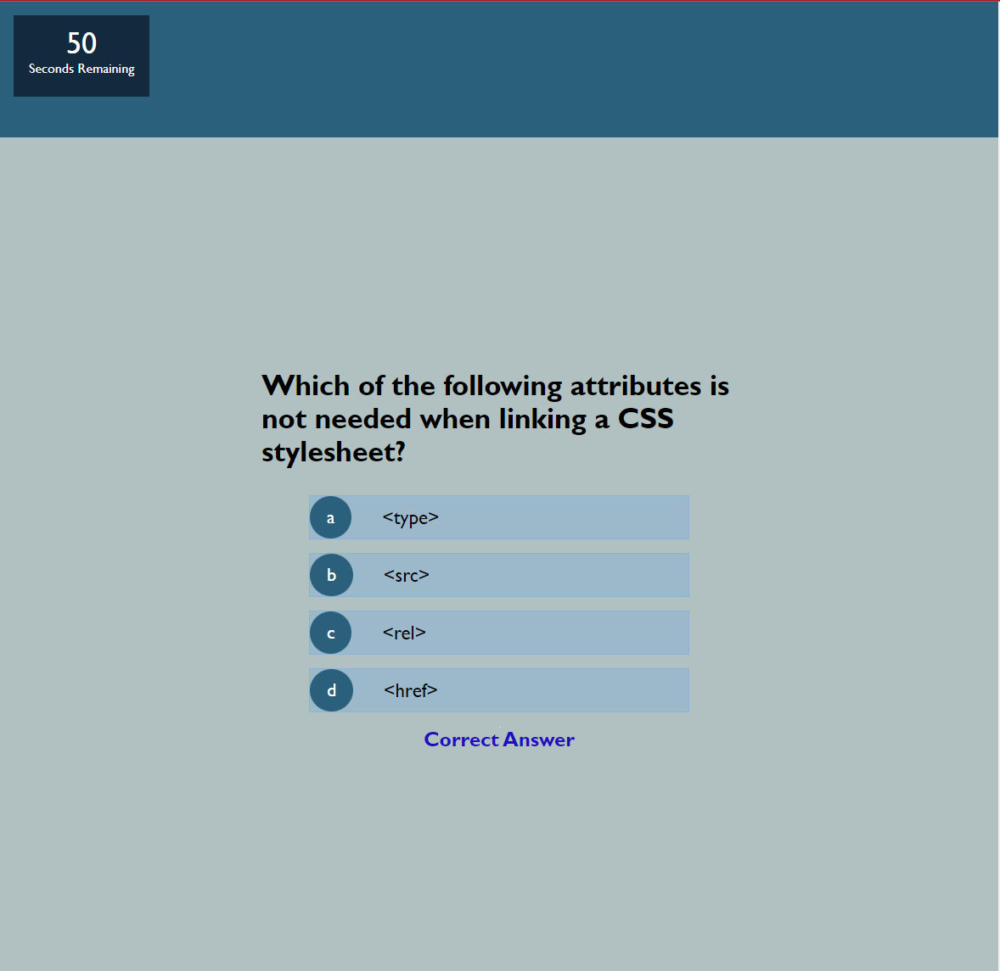
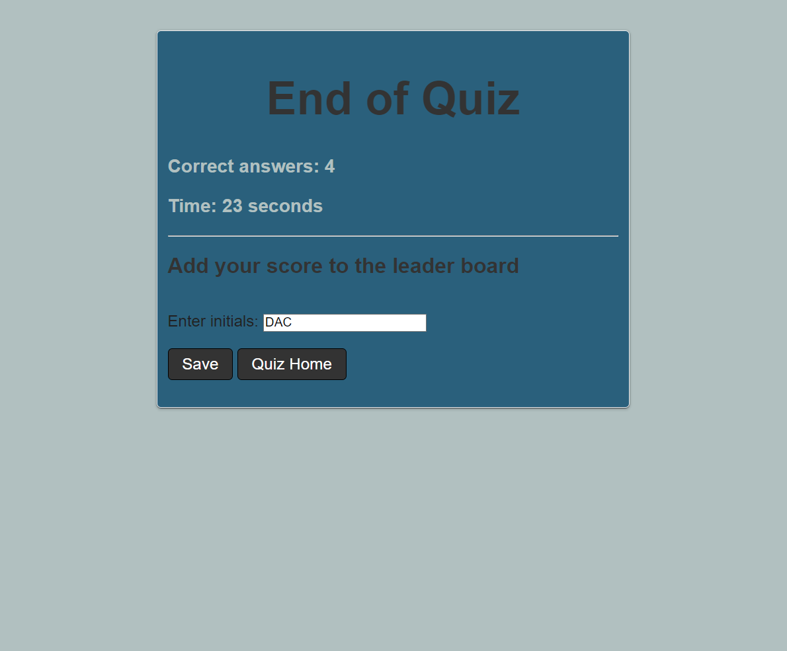
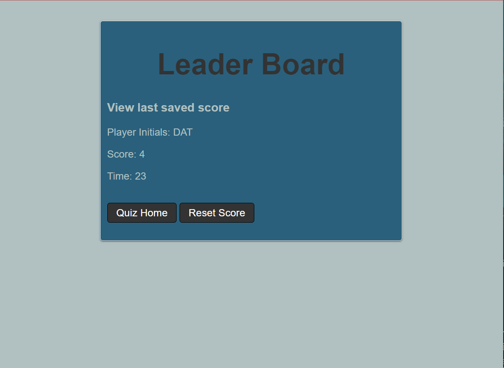

# Web APIs: Code Quiz

This challenge forms part of the course work for week 4, Module 4, set by the University of Birmingham and Trilogy Ltd's Coding Bootcamp.

## Project Description
---

The aim of this challenge was to build a timed coding quiz, from scratch, with multiple choice questions based on user selected criteria. 

## Project Requirements
---
This challenge required the app to run in the browswer and include dynamically updated HTML and CSS powered by JavaScipt code.

 
###  Mock-up of  Coding Quiz app

The following animation was provided as an example to show the  appearance and functionality needed to meet the criteria of this challenge.


The functionality that the quiz app was required to  implement is defined by the user story and acceptance criteria listed below.  


### User Story
```
AS A coding boot camp student
I WANT to take a timed quiz on JavaScript fundamentals that stores high scores
SO THAT I can gauge my progress compared to my peers

```


### Acceptance Criteria
```
GIVEN I am taking a code quiz
WHEN I click the start button
THEN a timer starts and I am presented with a question
WHEN I answer a question
THEN I am presented with another question
WHEN I answer a question incorrectly
THEN time is subtracted from the clock
WHEN all questions are answered or the timer reaches 0
THEN the game is over
WHEN the game is over
THEN I can save my initials and my score

```


## Approach 
---
Code Quiz app  functionality implemented in JavaScript, HTML and CSS:
- a timer has been implemented to count down to zero
- questions are displayed dynamically
- An array of ojects has been used to store the questions  
- A copy of the array of objects is made so that questions are displayed randomly each timer a user plays a game.
  - questions are removed from the coied array of objects to elimate repition.
- conditional statements have been used to test that the deducted time for each in correcct answer does not go below zero, in this case the game would end.
- conditonal statements test for the timer reaching zero and/or all questions having been answered
- This app uses linked HTML pages, local storage has been used to enable user scores and times to be used between the 'quiz' and 'quiz end' HTML pages.
- Local storage has been used to add user intials, score and timing information to a leader board


 
## Usage
---
- Open the <a href="https://beanalini.github.io/showTime/">Coding Quiz App.</a>
- In the 'Coding Quiz' home page there are two buttons that link to different pages:
  - the 'Start Quiz' button begins the quiz.  The user has 120 seconds to answer as many questiona as possible, 10 seconds will be deducted from the clock for each wrong answer!
  - the 'Leader Board' button links to the highest scores page which lists the last saved initals, number of correct answers and the time taken.
- After clicking the 'start Quiz' button,   a question and four possible answer options will be displayed. Click on the preferered answer - incorrect or correct will be displayed below the set of questions.
- When the timer runs out, or all questions have been answered, the screen will transistion to the 'End of Quiz' page, the user score and time taken are displayed.  There is also an option to save a score to the leader board by pressing the 'save' button. Press the 'Quiz Home' button to return to the 'Coding Quiz' home page.
- View the leaderboard score from the Coding Quiz homepage. 

##  Code Quiz Screen Shots
---

Code Quiz Landing Page




Quiz Page with muliple choice questions - showing answer selection correct.




Quiz over page with option to save user initials and score details to the leader board.





Leader board page showing current high score.


## Deployed Website
---

<a href="https://beanalini.github.io/showTime/">Link to the deployed website </a>


<a href="https://github.com/Beanalini/showTime"> Link to the Code quiz app repository</a>

## Technologies Used
---
- HTML
- CSS
- JavaScript
